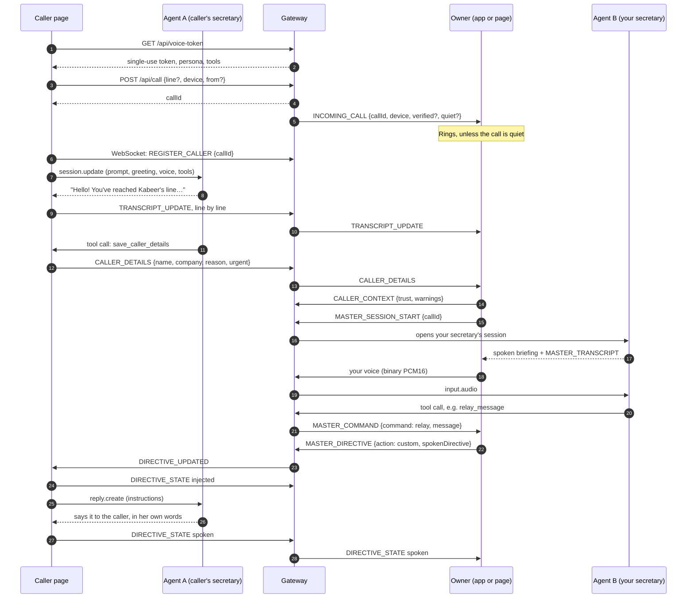
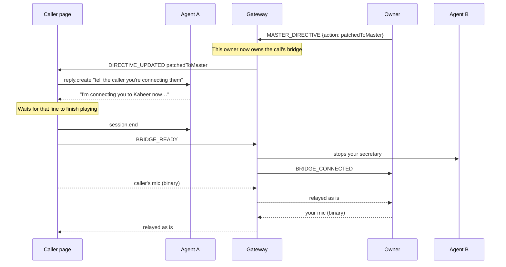
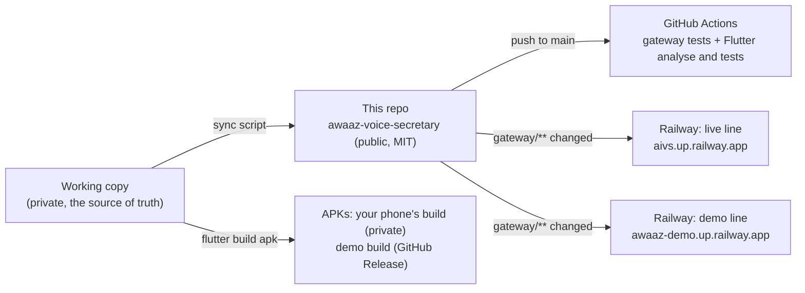

# Workflow

This document has two halves:
- **Part 1: how a call flows through Awaaz**, step by step, message by message, for every branch a call can take.
- **Part 2: how Awaaz itself is built, tested, released and deployed.**

The components are described in [ARCHITECTURE.md](ARCHITECTURE.md), and every situation a call can end up in is catalogued in [SCENARIOS.md](SCENARIOS.md).

**Names used below:**
- **Caller page:** the browser page the caller uses.
- **Agent A:** the caller's secretary, an AssemblyAI Voice Agent session running in the caller's browser.
- **Gateway:** the Node.js server.
- **Owner:** the Android app, or the owner page in a browser.
- **Agent B:** your own secretary, a second Voice Agent session that the gateway runs for you.

---

# Part 1: the life of a call

## 1.1 The whole call at a glance

## 1.2 Step by step

| # | Step | What happens | Messages |
|---|---|---|---|
| 1 | **The caller presses Call** | The caller page starts the microphone and fetches a single-use token and the secretary's persona. The API key never leaves the gateway. | `GET /api/voice-token` |
| 2 | **The call is registered** | The gateway creates a call with a random id. It records the caller's browser id and line, checks a personal-link token and the blocked list, and decides whether the call rings or is quiet. | `POST /api/call` |
| 3 | **Your phone rings** | Every owner connected to that line receives the call. The Android app rings over the lock screen, even when closed; the owner page rings while it's open. | `INCOMING_CALL` |
| 4 | **The caller's socket joins** | The caller page opens its own connection to the gateway. That starts the take-message timer: 90 s normally, 12 s when you're away. | `REGISTER_CALLER` |
| 5 | **The secretary answers** | The caller page connects to AssemblyAI. Its first message sets the prompt, greeting, voice and tools, and the secretary greets the caller. | `session.update` |
| 6 | **Screening** | She learns the caller's name, company, reason and urgency. Each line of the conversation is forwarded to you. | `TRANSCRIPT_UPDATE` |
| 7 | **Details confirmed** | Her `save_caller_details` tool records what the caller confirmed. The gateway cleans and merges the fields, and forwards them. | `CALLER_DETAILS` |
| 8 | **Trust** | Your app works out who is really calling: verified by a personal link, recognised, not verified, or a warning. It tells the gateway, so your secretary briefs you the same way. | `CALLER_CONTEXT` |
| 9 | **Your secretary joins** | When you answer, or automatically if the app is set to, the gateway opens a second AssemblyAI session, private to you. | `MASTER_SESSION_START` |
| 10 | **The briefing** | About 0.7 s after the details arrive, your secretary tells you who is calling and why: "Someone calling as Maria Lopez from Brightline Studios…". She mentions only confirmed facts, and the most important warning first. | audio, `MASTER_TRANSCRIPT` |
| 11 | **You decide** | You talk to her ("What does she need?", "Tell her I'll call back") or tap a button. Her tool calls become commands on your device, which runs the same code as the buttons. | `MASTER_COMMAND` |
| 12 | **The instruction reaches the caller** | Your device sends a numbered instruction. The gateway routes it only to this call's caller page, which turns it into an instruction for agent A. | `MASTER_DIRECTIVE`, `DIRECTIVE_UPDATED`, `reply.create` |
| 13 | **Confirmation** | The caller page reports the instruction as "injected" when it's given to the agent, and "spoken" when she has said it. You see the status on your screen. | `DIRECTIVE_STATE` |
| 14 | **The call ends** | Someone hangs up, or the secretary says goodbye. The gateway tells your device, which files the call record and asks for an AI summary. | `CALLER_HUNG_UP`, `POST /api/analyze-call` |

## 1.3 The branches

### Put the caller through (the live bridge)

From here it's two people and no AI: the gateway relays raw audio in both directions. The call stays open until one of you hangs up. If you hang up, the caller page ends too (`hangup`). If your device disconnects, the caller hears that the bridge ended (`BRIDGE_ENDED`).

### Hold

1. You say *"hold for five minutes"* or tap Hold. Your device sends `holding` with the minutes (1 to 30).
2. The secretary tells the caller politely, and your screen counts down.
3. When the time is up, your device doesn't connect a caller to someone who may not be there. It sends `checkIn` instead: the secretary asks the caller whether they'd like to keep waiting or leave a message, and your phone alerts you.

### Relay a message

You say *"tell her I'm in a meeting and I'll call back in ten minutes"*. Your secretary calls `relay_message`, and your device sends it as a `custom` instruction. The caller hears it in the secretary's own words and in the third person: "Kabeer is in a meeting and will call you back in ten minutes."

### End the call, or decline it

1. You say *"end the call"* or tap End. Your device sends `declined`.
2. Before any goodbye, the caller's secretary makes sure she can reach the caller: a number or email, and the best time. She reads a number back digit by digit, or spells an email back, and asks the caller to confirm. Spoken digits ("zero three zero one…") are normalised to digits.
3. She records it with `save_caller_details`, says goodbye, and ends the call herself. A two-minute safety net ends the call if she doesn't.
4. Your device keeps listening until the caller hangs up, so details confirmed after you pressed End still reach the call record. They become a "Call back" task with a button that dials.

### Nobody answers

If you haven't acted within 90 seconds, the gateway tells the caller page to take a message (`TAKE_MESSAGE`). The secretary says you can't take the call, takes the message and a way to reach the caller, reads it back, and ends the call. Your device shows "Taking a message for you". Talking with your own secretary counts as attending to the call, so the timer waits while you do.

### You're away (busy or do not disturb)

Your availability travels with your settings (`OWNER_SETTINGS`).
1. **A quiet call:** a call that arrives while you're away doesn't ring. After 12 seconds the secretary says you're not taking calls, and when you'll be free if you set a time ("He expects to be free after 3:00 PM"). She takes a message.
2. **Always ring:** contacts you set to "always ring" still ring through, but only when they call through their personal link.
3. **Never ring:** contacts set to "never ring" always get the secretary's message-taking instead.

### A second caller

1. A call that arrives while you're on another is screened by its own secretary, and waits.
2. Your secretary knows who is waiting ("Also calling: …").
3. If you're on the live bridge, a caller whose message is taken hears "Kabeer is on another call".
4. When your current call ends, the waiting caller comes up next. If they hang up first, your device fetches what the secretary took down (`SYNC_MISSED_CALLS`).

### Your device is offline

1. The gateway remembers ended calls for up to 24 hours (at most 50) until an owner device confirms it has filed them (`CALL_LOGGED`).
2. When your device reconnects, it receives them as `MISSED_CALLS`, each with the caller's details, message and a call-back task.
3. If it reconnects while a call is still live, that call is replayed to it (`INCOMING_CALL`), so nothing is lost.

### After the call

Your device sends the conversation to `POST /api/analyze-call`. The gateway asks AssemblyAI's LLM Gateway for:
- a one-sentence summary;
- the most important follow-up;
- a sentiment score.

These are stored with the call record, next to any tasks you dictated.

## 1.4 Your settings

Your device sends `OWNER_SETTINGS` every time it connects and whenever something changes. It carries:
- **Availability:** available, busy until a time, or do not disturb, plus a note.
- **Personal links:** the tokens you've handed out, each with its "always ring" or "never ring" setting.
- **Blocked browsers.**

The gateway keeps these in memory for that line, so they come back on their own after a gateway restart. The owner page sends settings only on a demo line; on the live line it leaves them to the phone app, so it never overwrites them.

---

# Part 2: how Awaaz is built and shipped

## 2.1 Where the code lives

- **The working copy** holds the gateway (`sidekick_server/`), the Flutter app, tests and internal notes. It is private and has no remote.
- **This repository** is the public Hackathon Edition. A sync script copies in the gateway, the web pages, the app's source and the tests. It never copies internal notes, secrets, keystores or build output.
- **The original server repository** (`kabeerkhanniazi/Awaaz`) is archived. It keeps the gateway's history from 26 August 2026.

## 2.2 Making a change

1. **Change and test locally.** Run `npm test` for the gateway: 28 checks, with no network or API key needed. Run `flutter analyze --fatal-infos` and `flutter test` for the app: 34 tests.
2. **Try it live on a local gateway.** Run the gateway on your laptop with a real AssemblyAI key. Scripted callers play the caller page's part: they register calls, send transcript lines and caller details, answer instructions, and open the bridge. That lets every branch be exercised against the real Voice Agent API without a second person. See [TESTING.md](TESTING.md).
3. **Commit** in the working copy.
4. **Deploy** with the deploy script, which:
   1. brings this repo up to date from GitHub;
   2. syncs the working copy into it;
   3. **scans every file that would be published for secrets**, including the actual values in `.env`, and stops if anything matches;
   4. runs the gateway tests, and stops if one fails;
   5. commits and pushes.
5. **CI** runs both test suites on GitHub.
6. **Railway** rebuilds both lines, but only when files under `gateway/` changed. README or app-only changes don't restart the live line.
7. **Verify:** `GET /health` on each line shows the new commit (`buildSha`) and the right `demoMode`.

## 2.3 Releasing the Android app

| Build | Command | Where it goes |
|---|---|---|
| Your own phone | `flutter build apk --release` | Installed directly (`flutter run --release`, or copying the APK). Never published: it connects to the live line with your secret. |
| The demo app | `flutter build apk --release --dart-define=AWAAZ_DEMO_GATEWAY=wss://awaaz-demo.up.railway.app` | A GitHub Release with its SHA-256 checksum and install steps |

Before a demo release, the demo line's address is checked inside the compiled app, and the app is installed and run on an emulator. There, a scripted caller rings its line to confirm the whole path: the line code, ringing on that phone only, and the secretary joining.

## 2.4 Configuration changes

Railway variables live on each service (see [DEPLOYMENT.md](DEPLOYMENT.md)). The demo line's `ASSEMBLYAI_API_KEY` is a reference to the live service's variable (`${{web.ASSEMBLYAI_API_KEY}}`), so the key is set in exactly one place. Changing a variable redeploys that service.

## 2.5 If something breaks

- **A bad deploy:** in Railway, redeploy the previous deployment of the service. Then fix forward in the working copy and deploy again.
- **A failed build never replaces a running one.** Railway keeps the last good deployment live.
- **Restarts:** calls in progress and missed calls not yet collected live in memory. Avoid deploying the live line while a call is in progress.

## 2.6 Keeping the docs true

`docs/ARCHITECTURE.md` is generated from the working copy's architecture notes, with paths rewritten for this repo's layout. When the protocol changes, the "Gateway messages" section is updated in the same change as the code. The test counts quoted in the README and docs come from the latest test run.
